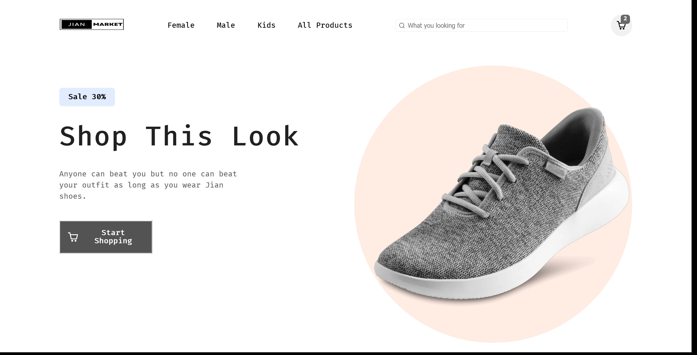

# Front-End E-Commerce Clothing Website
This project is a e-commerce website built with Next js.

## Overview


## Getting Started

To run the development server:

```bash
npm run dev
```

### Built with

- HTML5 & CSS
- [Next JS](https://nextjs.org/) - React Framework for Production
- [Sanity](https://www.sanity.io/) - Sanity is a customizable solution that treats content as data to power digital business.
- [react-hot-toast](https://react-hot-toast.com/) - react library that adds beautiful notifications to our react application. 
- [react icons](https://react-icons.github.io/react-icons/) - JS library to add icons
- [swiper js](https://swiperjs.com/) - JS library to add slider component

### Credit
[Figma Web Design & UI kit i used for this project is design by Weird Design Studio](https://ui8.net/ui-market/products/e-commerce-ui-website-design?status=7)